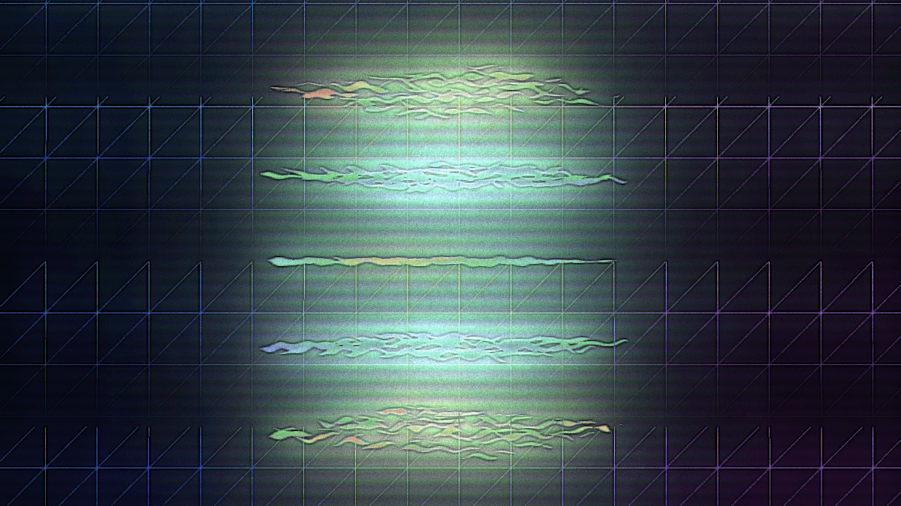

# l'emplacement exact du cœur, 2023

https://lemplacementexactducoeur.vercel.app

Interactive generative media installation on 43” screen, WebRTC with peerjs, WebGL with threlte, shaders, SvelteKit, firebase, Coturn

Endless

First shown at "Machinations of a Godless Mind", 17th to 26th of March 2023, Hatch Art Project, Singapore.

In l'emplacement exact du cœur, devices connected to the artwork communicate with each other, wherein the secret messages they exchange amongst themselves drive the evolution of the visuals. The messages are meaningless. This is a networked daydream built on disconnection. Language can act as a spell that constructs bridges across time and space between minds. It can also act as a prison; restricting what could have been with every utterance, simply by defining it.

Céline Minard's 2009 novel le dernier monde follows the last man on earth as he slowly descends into a state of constant daydream, struggling to keep his sanity without the company of fellow human beings. Somewhere in the midst of his delirium these words appear: "the exact location of the heart"—like a punch to the chest, to remind us of our loneliness and the difficulties of connecting with each other.

The piece is meant to be about language, the way we connect to each others, feelings and in particular loneliness.

When a device loads the website, it then proceeds to create peer to peer connections with the other devices connected to the site. They will then start exchanging random messages between each other. When a device receives a message, it also randomizes some parameters. There is a level of misunderstanding at this stage as well.

So, the machines are forming a network between them and having a conversation, which you are not part of. The experience you have with the visuals is very detached from the communication. And since this relies on peer to peer technologies rather than a centralized chatroom, all the connected devices aren't necessarily talking to each other. Instead we have a pretty asymmetrical network forming.

The only way you can interact with the site is by sharing it with someone. An share button will appear at the bottom if your browser supports it to underline that possibility. The message on the button is randomized and is an invitation to create a form of bond, ranging from "share" to "find love". Your screen will briefly flash when a connection or disconnection happens.

This is best experienced in a setting with friends around you to all open the site together and ponder on whether a connection has formed or not, while enjoying the endless variations of the visuals.
